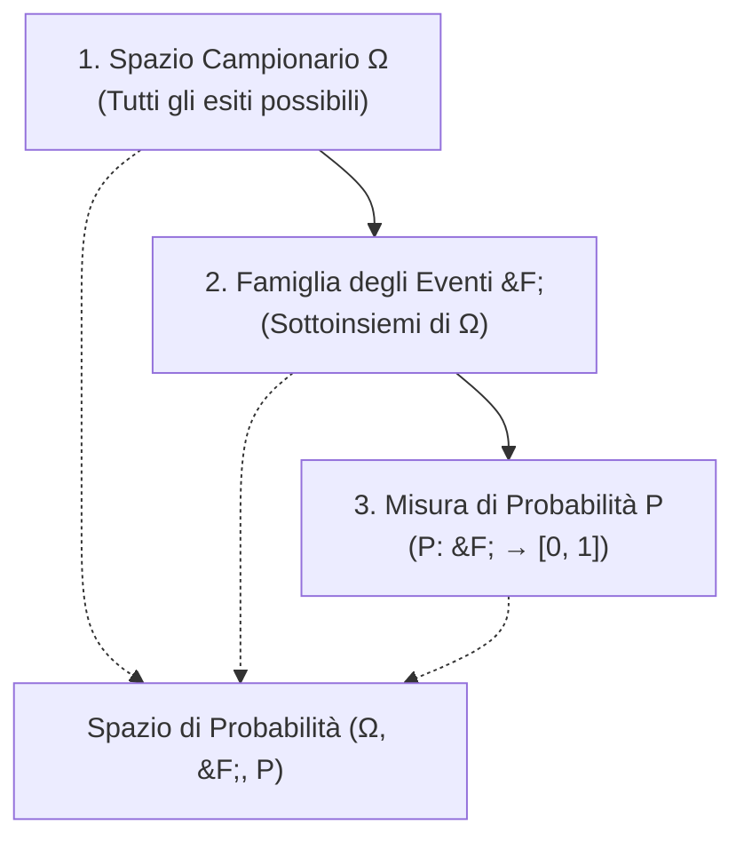

# Lezione 01 - Introduzione alla Probabilità e Spazi di Probabilità

---
**Docente:** Vito Onofrio Crivellari (`vitoonofrio.crivellari@uniba.it`)  
**Testi di riferimento:**
- Ross, *Statistica per l'Ingegneria e le Scienze*
- Baldi, *Calcolo delle Probabilità e Statistica*

**Modalità d'Esame:**
- Niente esoneri
- $\ge 18$: Niente orale obbligatorio (superato)
- $16 - 17$: Orale
- $\le 15$: Si rifà lo scritto

---

## 1. Cos'è uno Spazio di Probabilità?

> [!abstract] L'Idea in Parole Semplici
> La probabilità serve a **costruire modelli matematici** per prevedere il comportamento di esperimenti con esiti casuali. Per descrivere rigorosamente qualunque fenomeno aleatorio (dal lancio di una moneta alla durata di un componente elettronico), abbiamo bisogno di tre ingredienti fondamentali che formano la terna:
> $$\big(\Omega, \, \mathcal{F}, \, P\big)$$

---

## 2. I Tre Elementi Costitutivi

### Passo 1: Lo Spazio Campionario ($\Omega$)
È l'insieme di **tutti i possibili esiti** di un esperimento casuale.

- **Esempi discreti (finiti):**
  - Lancio di una moneta: $\Omega = \{T, C\}$
  - Lancio di un dado a 6 facce: $\Omega = \{1, 2, 3, 4, 5, 6\}$
- **Esempio continuo:**
  - Tempo in cui un apparato smette di funzionare: $\Omega = \mathbb{R}_+ = \{t \in \mathbb{R} \mid t \ge 0\}$

---

### Passo 2: Lo Spazio degli Eventi ($\mathcal{F}$)
Costruiamo l'insieme degli oggetti di cui possiamo calcolare la probabilità. Tale insieme si denota con $\mathcal{F}$ e i suoi elementi sono detti **eventi**.

Generalmente si pone $\mathcal{F} = \mathcal{P}(\Omega) = 2^\Omega$ (insieme delle parti di $\Omega$), oppure $\mathcal{F} \subseteq 2^\Omega$ (in contesti continui più avanzati, $\sigma$-algebra).

- Se $\omega \in \Omega \implies \{\omega\} \in \mathcal{F}$, tale evento è detto **evento elementare**.
- Un evento non elementare è detto **evento composto**.
  - *Esempio (lancio del dado):*
    - $\{2\}$ è un evento **elementare**.
    - Esce un numero dispari: $\{1, 3, 5\}$ è un evento **composto**.

#### Operazioni tra eventi:
- $E, F \in \mathcal{F} \implies E \cup F \in \mathcal{F}$ *(accade **almeno uno** tra $E$ ed $F$)*
- $E, F \in \mathcal{F} \implies E \cap F \in \mathcal{F}$ *(accadono **entrambi**)*
- $E \in \mathcal{F} \implies E^c \in \mathcal{F}$ *(evento complementare: $E$ **non** accade)*

---

### Passo 3: La Misura di Probabilità ($P$)
Definiamo una funzione:
$$P: \mathcal{F} \longrightarrow [0, 1]$$
che ad ogni evento $E \in \mathcal{F}$ associa un numero reale $P(E)$.

#### Gli Assiomi di Kolmogorov
$P$ verifica i seguenti assiomi:
1. **(A1) Non negatività / Normalizzazione:**  
   $$\forall A \in \mathcal{F}, \quad P(A) \in [0, 1]$$
2. **(A2) Certezza:**  
   $$P(\Omega) = 1$$  
   ($\Omega$ è detto **evento certo**).
3. **(A3) $\sigma$-additività (Additività numerabile):**  
   Sia $\{A_n\}_{n \ge 1}$ una successione di eventi **a due a due disgiunti** (cioè $A_i \cap A_j = \emptyset$ se $i \neq j$). Allora:
   $$P\left( \bigcup_{n=1}^\infty A_n \right) = \sum_{n=1}^\infty P(A_n)$$

> [!note] Definizione di Spazio di Probabilità
> Uno **spazio di probabilità** è formalmente definito dalla terna:
> $$\big(\Omega, \, \mathcal{F}, \, P\big)$$

---

## 3. Proprietà Fondamentali e Dimostrazioni

| # | Proprietà | Enunciato |
|---|---|---|
| **1** | Formula di Decomposizione | $\forall A, B \in \mathcal{F}, \quad P(B) = P(B \cap A) + P(B \cap A^c)$ |
| **2** | Monotonia | $\forall A, B \in \mathcal{F}, \text{ se } A \subseteq B \implies P(A) \le P(B)$ |
| **3** | Probabilità del Complementare | $\forall A \in \mathcal{F}, \quad P(A^c) = 1 - P(A)$ |
| **4** | Principio di Inclusione-Esclusione | $\forall A, B \in \mathcal{F}, \quad P(A \cup B) = P(A) + P(B) - P(A \cap B)$ |
| **Oss.** | Evento Impossibile | Poiché $\emptyset = \Omega^c$, dalla (3) segue: $P(\emptyset) = 1 - P(\Omega) = 0$ ($\emptyset$ è detto **evento impossibile**). |

---

### Dimostrazioni Passo-Passo

#### Dimostrazione 1: $P(B) = P(B \cap A) + P(B \cap A^c)$
1. Notiamo che lo spazio totale si decompone come unione disgiunta: $\Omega = A \cup A^c$.
2. Intersecando $B$ con $\Omega$:
   $$B = B \cap \Omega = B \cap (A \cup A^c) = (B \cap A) \cup (B \cap A^c)$$
3. Gli eventi $(B \cap A)$ e $(B \cap A^c)$ sono tra loro **disgiunti**, poiché $A \cap A^c = \emptyset$.
4. Per l'assioma di additività (A3):
   $$P(B) = P\big((B \cap A) \cup (B \cap A^c)\big) = P(B \cap A) + P(B \cap A^c) \quad \blacksquare$$

---

#### Dimostrazione 2: Se $A \subseteq B \implies P(A) \le P(B)$
1. Se $A \subseteq B$, allora l'intersezione $B \cap A$ coincide esattamente con $A$ (cioè $B \cap A = A$).
2. Usiamo la Proprietà 1:
   $$P(B) = P(B \cap A) + P(B \cap A^c) = P(A) + P(B \cap A^c)$$
3. Per l'assioma (A1), ogni probabilità è non negativa, quindi $P(B \cap A^c) \ge 0$.
4. Di conseguenza:
   $$P(B) = P(A) + \underbrace{P(B \cap A^c)}_{\ge 0} \ge P(A) \implies P(A) \le P(B) \quad \blacksquare$$

---

#### Dimostrazione 3: $P(A^c) = 1 - P(A)$
1. Abbiamo $\Omega = A \cup A^c$, con $A \cap A^c = \emptyset$.
2. Applicando l'assioma (A3):
   $$P(\Omega) = P(A \cup A^c) = P(A) + P(A^c)$$
3. Ma per l'assioma (A2), sappiamo che $P(\Omega) = 1$.
4. Sostituendo:
   $$1 = P(A) + P(A^c) \iff P(A^c) = 1 - P(A) \quad \blacksquare$$

---

#### Dimostrazione 4: $P(A \cup B) = P(A) + P(B) - P(A \cap B)$
1. Decomponiamo l'unione $A \cup B$ usando la partizione $\Omega = A \cup A^c$:
   $$A \cup B = (A \cup B) \cap \Omega = (A \cup B) \cap (A \cup A^c) = A \cup (B \cap A^c)$$
2. I due insiemi $A$ e $(B \cap A^c)$ sono disgiunti ($A \cap (B \cap A^c) = \emptyset$).
3. Applicando (A3):
   $$P(A \cup B) = P(A) + P(B \cap A^c)$$
4. Dalla Proprietà 1 sappiamo che:
   $$P(B) = P(B \cap A) + P(B \cap A^c) \implies P(B \cap A^c) = P(B) - P(A \cap B)$$
5. Sostituendo questa espressione:
   $$P(A \cup B) = P(A) + P(B) - P(A \cap B) \quad \blacksquare$$

---

## 4. Checkpoint & Trabocchetti d'Esame

> [!danger] Trabocchetto d'Esame
> **Sommare probabilità senza verificare la disgiunzione:**  
> Non scrivere mai $P(A \cup B) = P(A) + P(B)$ a meno che tu non abbia esplicitamente verificato che $A \cap B = \emptyset$. Se non sono disgiunti, stai contando due volte la loro intersezione!

> [!question] La Domanda del Prof all'Orale
> **D:** *"Se un evento ha probabilità 0, è per forza l'insieme vuoto $\emptyset$?"*  
> **R:** No! L'evento impossibile $\emptyset$ ha sempre probabilità $0$ ($P(\emptyset) = 0$), ma il viceversa non è sempre vero (specialmente negli spazi continui). Ad esempio, la probabilità che un componente si rompa esattamente all'istante $t = \pi$ secondi è $0$, pur essendo un evento appartenente allo spazio campionario.
